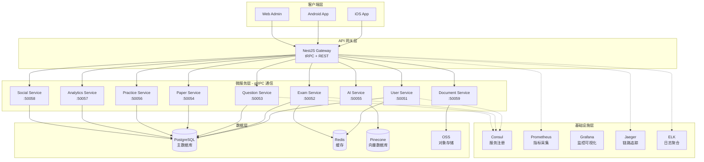

# 🎓 QuizMind - AI 智能题库学习系统

<div align="center">


**企业级 AI 智能题库系统 | NestJS + React Native + TypeScript 全栈解决方案**

[](https://www.typescriptlang.org/)
[](https://nodejs.org/)
[](https://nestjs.com/)
[](https://reactnative.dev/)
[](https://www.postgresql.org/)
[](https://redis.io/)
[](https://www.prisma.io/)
[](https://trpc.io/)
[](https://grpc.io/)
[](https://prometheus.io/)
[](https://grafana.com/)
[](https://www.docker.com/)
[](LICENSE)

</div>

---

## 📋 项目简介

**QuizMind** 是一个基于现代微服务架构的企业级 AI 智能题库学习平台，采用 **NestJS + React Native + TypeScript** 全栈技术方案，集成 **AI 智能批改、智能组卷、学习分析** 等核心功能，支持 **6 种练习模式**、**在线考试**、**错题本**、**社交 PK** 等丰富场景。

系统遵循阿里开发规范，实现完整的 **RBAC 权限体系**、**审计日志**、**分布式追踪**、**监控告警** 等企业级特性，具备高可用、高性能、易扩展的生产级能力。

---

## 🏗️ 技术架构

### 架构全景图



---

## 🔧 核心技术栈

### 🎯 服务端技术栈

#### **核心框架层**
| 技术 | 版本 | 用途 | 选型理由 |
|------|------|------|---------|
| **NestJS** | 10.0 | Node.js 企业级框架 | 🏆 TypeScript 原生支持、模块化架构、依赖注入、装饰器模式 |
| **TypeScript** | 5.3.3 | 静态类型语言 | 🛡️ 类型安全、IDE 智能提示、重构友好 |
| **Node.js** | 18+ LTS | JavaScript 运行时 | ⚡ 高并发、异步 I/O、生态丰富 |
| **pnpm** | 8.0+ | 包管理工具 | 📦 快速、节省空间、Monorepo 友好 |

#### **数据库 & ORM**
| 技术 | 版本 | 用途 | 选型理由 |
|------|------|------|---------|
| **PostgreSQL** | 16 | 关系型数据库 | 🗄️ ACID 保证、JSON 支持、性能优秀、开源免费 |
| **Prisma ORM** | 5.8 | 数据库访问层 | 🎨 类型安全、Schema 优先、迁移管理、无 SQL 注入 |
| **Redis** | 7.2 | 内存缓存数据库 | ⚡ 高性能缓存、会话存储、实时排行榜 |
| **Pinecone** | - | 向量数据库 | 🧠 AI 语义搜索、题目推荐、相似题查找 |

#### **微服务 & 通信**
| 技术 | 版本 | 用途 | 选型理由 |
|------|------|------|---------|
| **gRPC** | 1.60 | 微服务间通信 | 🚀 高性能 RPC、二进制协议、流式传输、类型强校验 |
| **Protocol Buffers** | 3.21 | 接口定义语言 | 📝 跨语言、强类型、高效序列化 |
| **tRPC** | 10.45 | 端到端类型安全 API | 🔗 TypeScript 端到端类型共享、无需代码生成 |
| **Consul** | 1.17 | 服务注册与发现 | 🎯 健康检查、KV 存储、多数据中心支持 |

#### **AI & 智能服务**
| 技术 | 版本 | 用途 | 选型理由 |
|------|------|------|---------|
| **DeepSeek API** | - | AI 大模型 | 🤖 智能批改、自动出题、学习建议 |
| **LangChain** | 0.1.0 | AI 应用框架 | 🔗 Prompt 管理、链式调用、向量存储集成 |
| **Tesseract OCR** | 5.3 | 文档识别 | 📄 试卷扫描、题目识别、文字提取 |

#### **企业级功能**
| 技术 | 版本 | 用途 | 选型理由 |
|------|------|------|---------|
| **Passport.js** | 0.7 | 认证中间件 | 🔐 多策略支持、JWT、社交登录 |
| **JWT** | 9.0 | 无状态认证 | 🎫 跨服务认证、无状态、可扩展 |
| **Bull Queue** | 5.0 | 消息队列 | 📮 异步任务、邮件发送、报告生成 |
| **Nodemailer** | 6.9 | 邮件服务 | 📧 验证码、通知、成绩单发送 |
| **Multer** | 1.4 | 文件上传 | 📤 题目图片、文档上传、多文件处理 |
| **class-validator** | 0.14 | 数据验证 | ✅ 装饰器验证、类型安全、自动校验 |
| **class-transformer** | 0.5 | 数据转换 | 🔄 DTO 转换、序列化、反序列化 |

---

### 📱 移动端技术栈

#### **核心框架**
| 技术 | 版本 | 用途 | 选型理由 |
|------|------|------|---------|
| **React Native** | 0.82 | 跨平台移动框架 | 📱 一次开发、双端运行、原生性能、热更新 |
| **TypeScript** | 5.3 | 类型系统 | 🛡️ 类型安全、减少运行时错误 |
| **React** | 18.2 | UI 库 | ⚛️ 组件化、Hooks、生态丰富 |

#### **状态管理 & 数据获取**
| 技术 | 版本 | 用途 | 选型理由 |
|------|------|------|---------|
| **Redux Toolkit** | 2.0 | 全局状态管理 | 📦 简化 Redux、内置 Immer、DevTools |
| **React Query** | 5.0 | 服务端状态管理 | 🔄 缓存、重试、轮询、自动更新 |
| **tRPC Client** | 10.45 | API 调用 | 🔗 类型安全、自动补全、端到端类型 |

#### **路由 & 导航**
| 技术 | 版本 | 用途 | 选型理由 |
|------|------|------|---------|
| **React Navigation** | 6.0 | 导航框架 | 🧭 Stack/Tab/Drawer 导航、深度链接 |

#### **UI 组件库**
| 技术 | 版本 | 用途 | 选型理由 |
|------|------|------|---------|
| **React Native Paper** | 5.11 | Material Design 组件 | 🎨 Material 3、主题化、可访问性 |
| **React Native Vector Icons** | 10.0 | 图标库 | 🎯 丰富图标、自定义颜色、多套图标集 |
| **React Native SVG** | 14.0 | SVG 渲染 | 🖼️ 矢量图形、图表、动画 |

#### **开发工具**
| 技术 | 版本 | 用途 | 选型理由 |
|------|------|------|---------|
| **Metro** | 0.80 | 打包工具 | 📦 React Native 官方打包器、热更新 |
| **Babel** | 7.23 | JavaScript 编译器 | 🔄 新语法转换、插件生态 |
| **Jest** | 29.7 | 测试框架 | ✅ 快照测试、覆盖率报告 |

---

### 🔍 监控 & 运维技术栈

#### **指标监控**
| 技术 | 版本 | 用途 | 选型理由 |
|------|------|------|---------|
| **Prometheus** | 2.48 | 指标采集与存储 | 📊 时序数据库、PromQL 查询、丰富的 Exporter |
| **Grafana** | 10.2 | 可视化监控面板 | 📈 实时仪表盘、告警、多数据源 |
| **@willsoto/nestjs-prometheus** | 6.0 | NestJS Prometheus 集成 | 🔗 装饰器支持、自动指标收集 |

#### **链路追踪**
| 技术 | 版本 | 用途 | 选型理由 |
|------|------|------|---------|
| **Jaeger** | 1.52 | 分布式追踪 | 🔍 微服务调用链、性能分析、依赖关系图 |
| **OpenTelemetry** | 1.19 | 可观测性标准 | 🌐 统一标准、自动埋点、多后端支持 |

#### **日志聚合**
| 技术 | 版本 | 用途 | 选型理由 |
|------|------|------|---------|
| **Elasticsearch** | 8.11 | 日志存储与搜索 | 🔎 全文搜索、聚合分析、水平扩展 |
| **Logstash** | 8.11 | 日志采集与处理 | 📥 多源采集、过滤转换、路由分发 |
| **Kibana** | 8.11 | 日志可视化 | 📊 日志查询、可视化、告警 |
| **Winston** | 3.11 | 日志库 | 📝 多传输方式、日志分级、结构化日志 |

#### **告警**
| 技术 | 版本 | 用途 | 选型理由 |
|------|------|------|---------|
| **Alertmanager** | 0.26 | 告警管理 | 🚨 告警聚合、静默、路由、通知 |

#### **容器化 & 编排**
| 技术 | 版本 | 用途 | 选型理由 |
|------|------|------|---------|
| **Docker** | 24.0 | 容器化 | 🐳 环境一致性、快速部署、资源隔离 |
| **Docker Compose** | 2.23 | 多容器编排 | 🎼 本地开发、测试环境、快速启动 |

---

### 🧪 测试技术栈

| 技术 | 版本 | 用途 | 选型理由 |
|------|------|------|---------|
| **Jest** | 29.7 | 单元测试框架 | ✅ 快照测试、并行执行、覆盖率 |
| **Supertest** | 6.3 | HTTP 测试 | 🧪 API 测试、请求断言 |
| **@nestjs/testing** | 10.0 | NestJS 测试工具 | 🔬 依赖注入测试、Mock 模块 |

---

### 🛠️ 开发工具链

| 工具 | 版本 | 用途 |
|------|------|------|
| **ESLint** | 8.56 | 代码检查 |
| **Prettier** | 3.1 | 代码格式化 |
| **Husky** | 8.0 | Git Hooks |
| **lint-staged** | 15.2 | 暂存区代码检查 |
| **commitlint** | 18.4 | 提交信息规范 |
| **tsx** | 4.7 | TypeScript 执行器 |
| **nodemon** | 3.0 | 文件监听重启 |

---

## 📊 技术栈对比与选型

### 为什么选择 NestJS 而不是 Express/Koa？

| 特性 | NestJS | Express | Koa |
|------|--------|---------|-----|
| **TypeScript 支持** | ✅ 原生 | ⚠️ 需配置 | ⚠️ 需配置 |
| **架构模式** | ✅ 模块化 + 依赖注入 | ❌ 无约束 | ❌ 无约束 |
| **装饰器** | ✅ 丰富 | ❌ 无 | ❌ 无 |
| **微服务支持** | ✅ 内置 gRPC/TCP/Redis | ⚠️ 需手动 | ⚠️ 需手动 |
| **测试友好** | ✅ 依赖注入易测试 | ⚠️ Mock 困难 | ⚠️ Mock 困难 |
| **企业级特性** | ✅ 完整生态 | ❌ 需自建 | ❌ 需自建 |

**结论**：NestJS 提供开箱即用的企业级架构，适合大型项目。

---

### 为什么选择 Prisma 而不是 TypeORM/Sequelize？

| 特性 | Prisma | TypeORM | Sequelize |
|------|--------|---------|-----------|
| **类型安全** | ✅ 100% | ⚠️ 80% | ❌ 需手动 |
| **迁移管理** | ✅ 声明式 | ⚠️ 命令式 | ⚠️ 命令式 |
| **N+1 问题** | ✅ 自动优化 | ❌ 易踩坑 | ❌ 易踩坑 |
| **性能** | ✅ 优秀 | ⚠️ 一般 | ⚠️ 一般 |
| **开发体验** | ✅ 现代化 | ⚠️ 配置复杂 | ❌ API 陈旧 |

**结论**：Prisma 提供最佳的类型安全和开发体验。

---

### 为什么选择 tRPC 而不是 REST/GraphQL？

| 特性 | tRPC | REST | GraphQL |
|------|------|------|---------|
| **类型安全** | ✅ 端到端 | ❌ 无 | ⚠️ 需 Codegen |
| **学习成本** | ✅ 低 | ✅ 低 | ❌ 高 |
| **开发效率** | ✅ 极高 | ⚠️ 中等 | ⚠️ 中等 |
| **实时更新** | ✅ Subscriptions | ❌ 需 WebSocket | ✅ Subscriptions |
| **生态成熟度** | ⚠️ 新兴 | ✅ 成熟 | ✅ 成熟 |

**结论**：在 TypeScript 全栈项目中，tRPC 提供最高的开发效率。

---

## ✨ 核心功能

### 🎯 学员端（移动端）
- ✅ **6 种练习模式** - 顺序练习、随机练习、专项练习、题型练习、错题练习、章节练习
- ✅ **背题模式** - 卡片式翻页、自动播放、掌握度标记、快速背题
- ✅ **在线考试** - 实时监考、防作弊、自动计时、智能评分
- ✅ **错题本** - 错题收集、智能复习、订正记录、掌握度追踪
- ✅ **学习分析** - 学习时长、正确率、能力雷达图、知识点掌握度
- ✅ **社交功能** - 全站排行榜、好友 PK、题目讨论、错题分享

### 👨‍🏫 教师端（Web 管理）
- ✅ **题库管理** - 单选、多选、判断、填空、问答 5 种题型
- ✅ **分类管理** - 多级分类、标签系统、批量操作
- ✅ **智能组卷** - AI 辅助出题、难度平衡、知识点覆盖
- ✅ **考试监控** - 实时查看考试状态、异常检测、成绩统计
- ✅ **学员管理** - 成绩分析、学习报告、个性化建议

### 🚀 企业级特性
- ✅ **微服务架构** - 9 个独立微服务、gRPC 高性能通信、服务注册发现
- ✅ **完整监控** - Prometheus 指标采集、Grafana 可视化、Jaeger 链路追踪、ELK 日志分析
- ✅ **AI 赋能** - DeepSeek 智能批改、自动出题、学习路径推荐
- ✅ **RBAC 权限** - 角色权限管理、细粒度权限控制、权限继承
- ✅ **审计日志** - 完整操作记录、数据变更追踪、合规审计
- ✅ **高可用保障** - 服务降级、熔断器、限流、重试机制

---

## 🚀 快速开始

### 环境要求

```bash
Node.js >= 18.0.0
pnpm >= 8.0.0
PostgreSQL >= 16
Redis >= 7.2
Docker >= 24.0 (可选，用于监控栈)
```

### 一键启动

```bash
# 1. 克隆项目
git clone https://github.com/linlingqin77/quizmind.git
cd quizmind

# 2. 安装依赖
pnpm install

# 3. 配置环境变量
cd packages/server
cp .env.example .env
# 编辑 .env 文件，配置数据库等信息

# 4. 初始化数据库
npx prisma generate
npx prisma db push
npx prisma db seed

# 5. 启动监控栈（可选）
chmod +x scripts/*.sh
./scripts/start-monitoring.sh

# 6. 启动服务端
pnpm run start:dev

# 7. 启动移动端（新终端）
cd ../mobile
pnpm run ios  # 或 pnpm run android
```

### 访问地址

| 服务 | URL | 说明 |
|------|-----|------|
| **API Gateway** | http://localhost:3000 | tRPC API 端点 |
| **Swagger 文档** | http://localhost:3000/api | REST API 文档 |
| **Grafana** | http://localhost:3001 | 监控面板 (admin/admin) |
| **Prometheus** | http://localhost:9090 | 指标查询 |
| **Jaeger** | http://localhost:16686 | 链路追踪 |
| **Kibana** | http://localhost:5601 | 日志查询 |
| **Consul** | http://localhost:8500 | 服务注册 |

---

## 📂 项目结构

```
quizmind/
├── packages/
│   ├── server/                          # 🚀 NestJS 服务端
│   │   ├── src/
│   │   │   ├── core/                   # 核心模块
│   │   │   │   ├── config/            # 配置管理
│   │   │   │   ├── database/          # 数据库连接
│   │   │   │   ├── logging/           # 日志服务
│   │   │   │   ├── monitoring/        # 监控服务
│   │   │   │   └── trpc/              # tRPC 核心
│   │   │   │
│   │   │   ├── infrastructure/         # 基础设施模块
│   │   │   │   ├── prisma/            # Prisma 服务
│   │   │   │   ├── health/            # 健康检查
│   │   │   │   ├── metrics/           # Prometheus 指标
│   │   │   │   ├── trpc/              # tRPC 基础
│   │   │   │   └── websocket/         # WebSocket
│   │   │   │
│   │   │   ├── features/               # 业务功能模块
│   │   │   │   ├── auth/              # 认证授权
│   │   │   │   └── users/             # 用户管理
│   │   │   │
│   │   │   ├── enterprise/             # 企业级功能
│   │   │   │   ├── audit/             # 审计日志
│   │   │   │   ├── permissions/       # 权限管理
│   │   │   │   ├── email/             # 邮件服务
│   │   │   │   ├── upload/            # 文件上传
│   │   │   │   └── queue/             # 消息队列
│   │   │   │
│   │   │   ├── microservices/          # 微服务
│   │   │   │   ├── user-service/      # 用户服务 :50051
│   │   │   │   ├── exam-service/      # 考试服务 :50052
│   │   │   │   ├── question-service/  # 题目服务 :50053
│   │   │   │   ├── paper-service/     # 组卷服务 :50054
│   │   │   │   ├── ai-service/        # AI 服务 :50055
│   │   │   │   ├── practice-service/  # 练习服务 :50056
│   │   │   │   ├── analytics-service/ # 分析服务 :50057
│   │   │   │   ├── social-service/    # 社交服务 :50058
│   │   │   │   └── document-service/  # 文档服务 :50059
│   │   │   │
│   │   │   ├── presentation/           # 表现层
│   │   │   │   └── routers/           # tRPC 路由
│   │   │   │       ├── app.router.ts  # 根路由
│   │   │   │       ├── auth/          # 认证路由
│   │   │   │       ├── exams/         # 考试路由
│   │   │   │       └── questions/     # 题目路由
│   │   │   │
│   │   │   ├── shared/                 # 共享组件
│   │   │   │   ├── decorators/        # 装饰器
│   │   │   │   ├── guards/            # 守卫
│   │   │   │   ├── interceptors/      # 拦截器
│   │   │   │   ├── filters/           # 异常过滤器
│   │   │   │   └── services/          # 共享服务
│   │   │   │
│   │   │   └── main.ts                 # 应用入口
│   │   │
│   │   ├── prisma/                     # Prisma Schema
│   │   │   ├── schema.prisma          # 主 Schema
│   │   │   ├── schema-rbac.prisma     # RBAC Schema
│   │   │   ├── schema-audit.prisma    # 审计 Schema
│   │   │   └── seed.ts                # 数据库种子
│   │   │
│   │   ├── proto/                      # gRPC Proto 文件
│   │   │   ├── user.proto
│   │   │   ├── exam.proto
│   │   │   └── ...
│   │   │
│   │   ├── scripts/                    # 运维脚本
│   │   │   ├── start-monitoring.sh    # 启动监控栈
│   │   │   └── stop-monitoring.sh     # 停止监控栈
│   │   │
│   │   └── package.json
│   │
│   ├── mobile/                          # 📱 React Native 移动端
│   │   ├── src/
│   │   │   ├── screens/               # 页面
│   │   │   │   ├── auth/             # 登录注册
│   │   │   │   ├── exam/             # 考试
│   │   │   │   ├── practice/         # 练习
│   │   │   │   └── profile/          # 个人中心
│   │   │   │
│   │   │   ├── components/            # 组件
│   │   │   │   ├── common/           # 通用组件
│   │   │   │   └── exam/             # 考试组件
│   │   │   │
│   │   │   ├── navigation/            # 导航
│   │   │   ├── store/                # Redux Store
│   │   │   ├── services/             # API 服务
│   │   │   │   ├── trpc.ts          # tRPC 客户端
│   │   │   │   └── api.ts           # API 封装
│   │   │   │
│   │   │   ├── hooks/                # 自定义 Hooks
│   │   │   ├── utils/                # 工具函数
│   │   │   └── types/                # TypeScript 类型
│   │   │
│   │   ├── android/                   # Android 原生代码
│   │   ├── ios/                       # iOS 原生代码
│   │   └── package.json
│   │
│   └── shared/                          # 📦 共享类型库
│       ├── src/
│       │   ├── types/                 # TypeScript 类型定义
│       │   │   ├── user.ts
│       │   │   ├── exam.ts
│       │   │   └── question.ts
│       │   │
│       │   ├── constants/             # 常量
│       │   ├── validators/            # Zod 验证器
│       │   └── utils/                 # 工具函数
│       │
│       └── package.json
│
├── docs/                                # 📚 项目文档
│   ├── 前端完整开发指南.md
│   ├── 服务端完整开发指南.md
│   ├── 产品需求文档/
│   │   └── 产品需求文档(PRD).md
│   └── 服务端文档/
│       ├── ARCHITECTURE.md            # 架构设计
│       ├── ARCHITECTURE_DIAGRAMS.md   # 架构图集
│       ├── MONITORING_GUIDE.md        # 监控指南
│       └── COMPLETE_GUIDE.md          # 完整手册
│
├── pnpm-workspace.yaml                  # pnpm Monorepo 配置
├── tsconfig.base.json                   # TypeScript 基础配置
└── README.md                            # 本文档
```

---

## 🎯 微服务详解

| 服务名称 | 端口 | 职责 | 技术栈 |
|---------|------|------|--------|
| **API Gateway** | 3000 | 统一入口、路由转发、认证授权 | NestJS + tRPC |
| **User Service** | 50051 | 用户管理、认证、权限 | NestJS + gRPC + PostgreSQL |
| **Exam Service** | 50052 | 考试管理、监考、评分 | NestJS + gRPC + PostgreSQL |
| **Question Service** | 50053 | 题库管理、题目 CRUD | NestJS + gRPC + PostgreSQL |
| **Paper Service** | 50054 | 智能组卷、试卷模板 | NestJS + gRPC + PostgreSQL |
| **AI Service** | 50055 | AI 批改、智能出题、推荐 | NestJS + DeepSeek + Pinecone |
| **Practice Service** | 50056 | 练习模式、背题、错题本 | NestJS + gRPC + PostgreSQL |
| **Analytics Service** | 50057 | 数据分析、报表、学习曲线 | NestJS + gRPC + PostgreSQL |
| **Social Service** | 50058 | 排行榜、PK、讨论区 | NestJS + gRPC + Redis |
| **Document Service** | 50059 | OCR 识别、文档解析 | NestJS + Tesseract + OSS |

---

## 📊 监控告警体系

### 监控指标

#### **系统级指标**
- CPU 使用率、内存使用率、磁盘 I/O、网络流量
- 进程数、文件句柄数、线程数

#### **应用级指标**
- HTTP 请求量、响应时间、错误率
- gRPC 调用量、调用延迟、成功率
- 数据库查询时间、连接池状态
- Redis 命中率、键数量

#### **业务级指标**
- 注册用户数、活跃用户数
- 考试创建数、参与人数、完成率
- 题目练习数、正确率、平均耗时
- AI 调用次数、成功率、响应时间

### Grafana 仪表盘

1. **系统概览** - CPU、内存、网络、磁盘
2. **API 网关** - QPS、延迟、错误率、TOP 慢接口
3. **微服务健康** - 服务状态、调用量、成功率
4. **数据库监控** - 查询时间、慢查询、连接数
5. **业务大盘** - 用户活跃、考试统计、题目统计

### 告警规则

```yaml
# 服务可用性告警
- alert: ServiceDown
  expr: up{job="quizmind-api"} == 0
  for: 1m
  
# 高错误率告警
- alert: HighErrorRate
  expr: rate(http_requests_total{status=~"5.."}[5m]) > 0.05
  for: 5m
  
# 响应时间告警
- alert: SlowResponse
  expr: histogram_quantile(0.95, http_request_duration_seconds) > 1
  for: 10m
```

---

## 🧪 测试

### 单元测试

```bash
# 运行所有单元测试
pnpm test

# 监听模式
pnpm test:watch

# 测试覆盖率
pnpm test:cov
```

### 集成测试

```bash
# E2E 测试
pnpm test:e2e

# 指定测试文件
pnpm test:e2e -- auth.e2e-spec.ts
```

### API 测试

```bash
# 使用 REST Client 测试
# 安装 VSCode 插件：REST Client
# 打开 test/api.http 文件
```

---

## 📝 开发规范

### Git 提交规范

```bash
feat: 新功能
fix: Bug 修复
docs: 文档更新
style: 代码格式（不影响功能）
refactor: 重构
perf: 性能优化
test: 测试相关
build: 构建系统
ci: CI/CD
chore: 其他改动
revert: 回滚
```

### 分支管理

```
main - 生产环境
develop - 开发环境
feature/* - 功能分支
bugfix/* - Bug 修复
hotfix/* - 紧急修复
release/* - 发布分支
```

### 代码审查清单

- [ ] 代码符合 ESLint 规范
- [ ] 单元测试覆盖率 >= 80%
- [ ] 无 TypeScript 类型错误
- [ ] API 响应时间 < 500ms
- [ ] 数据库查询使用索引
- [ ] 敏感信息已加密
- [ ] 错误处理完整
- [ ] 日志记录充分
- [ ] 文档已更新

---

## 📚 文档导航

| 文档 | 说明 | 适合人群 |
|------|------|---------|
| [📱 前端完整开发指南](./docs/前端完整开发指南.md) | React Native 移动端开发 | 前端开发者 |
| [🚀 服务端完整开发指南](./docs/服务端完整开发指南.md) | NestJS 微服务架构 | 后端开发者 |
| [🏗️ 架构设计文档](./docs/服务端文档/ARCHITECTURE.md) | 系统架构、技术选型 | 架构师 |
| [📊 监控系统指南](./docs/服务端文档/MONITORING_GUIDE.md) | 监控部署、告警配置 | 运维工程师 |
| [📋 产品需求文档](./docs/产品需求文档/产品需求文档(PRD).md) | 完整产品需求 | 产品经理 |
| [🎯 项目管理与排期](./docs/项目管理与排期.md) | 开发计划、里程碑 | 项目经理 |

---

## 🤝 贡献指南

我们欢迎任何形式的贡献！

### 贡献流程

1. **Fork** 本仓库
2. 创建功能分支 (`git checkout -b feature/amazing-feature`)
3. 提交代码 (`git commit -m 'feat: Add amazing feature'`)
4. 推送到分支 (`git push origin feature/amazing-feature`)
5. 开启 **Pull Request**

### 贡献者公约

- 遵循代码规范
- 编写单元测试
- 更新相关文档
- 保持提交信息清晰

---

## 📄 开源协议

本项目采用 [MIT License](./LICENSE) 开源协议。

---

## 🙏 致谢

感谢以下开源项目：

- [NestJS](https://nestjs.com/) - 渐进式 Node.js 框架
- [React Native](https://reactnative.dev/) - 跨平台移动开发框架
- [Prisma](https://www.prisma.io/) - 下一代 TypeScript ORM
- [tRPC](https://trpc.io/) - 端到端类型安全 API
- [Prometheus](https://prometheus.io/) - 监控告警系统
- [Grafana](https://grafana.com/) - 可观测性平台
- [DeepSeek](https://www.deepseek.com/) - AI 大模型服务

---

## 📞 联系我们

- 📧 **Email**: linlingqin77@qq.com
- 💬 **Discussions**: [GitHub Discussions](https://github.com/linlingqin77/quizmind/discussions)
- 🐛 **Issues**: [GitHub Issues](https://github.com/linlingqin77/quizmind/issues)
- 📖 **文档**: [docs 目录](./docs/)

---

## 📈 项目状态


---

## 🌟 Star History

如果这个项目对你有帮助，请给个 ⭐️ Star 支持一下！

---

<div align="center">

**💡 提示：** 详细的技术文档都在 [`docs/`](./docs/) 目录下，根据你的角色选择对应的文档。

**Made with ❤️ by QuizMind Development Team**

**版本：** v1.0.0  
**最后更新：** 2025-10-15

</div>
