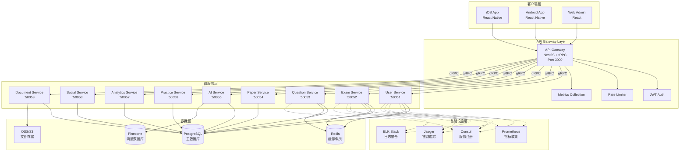
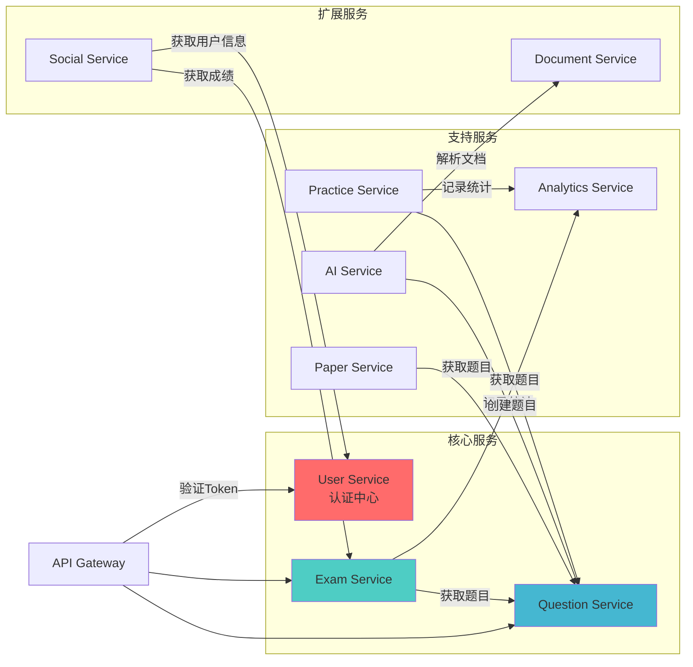
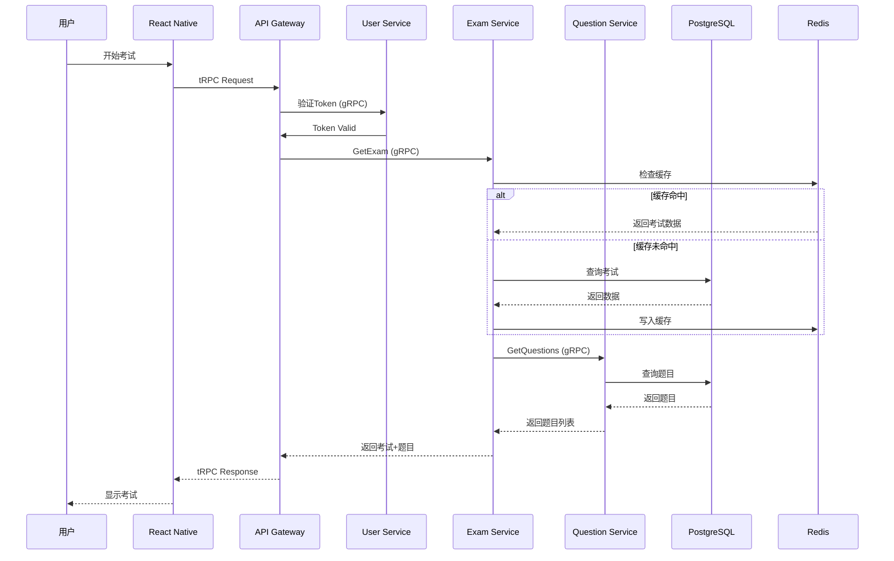
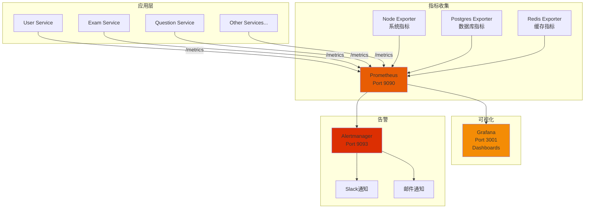
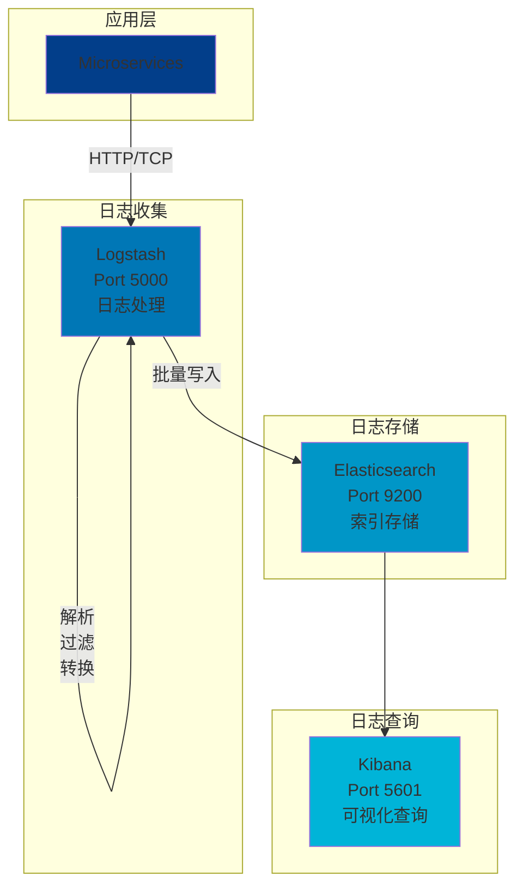
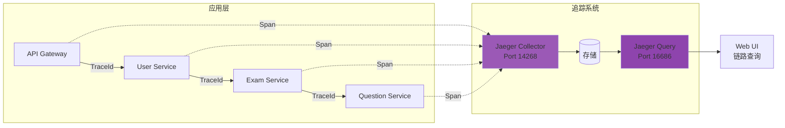
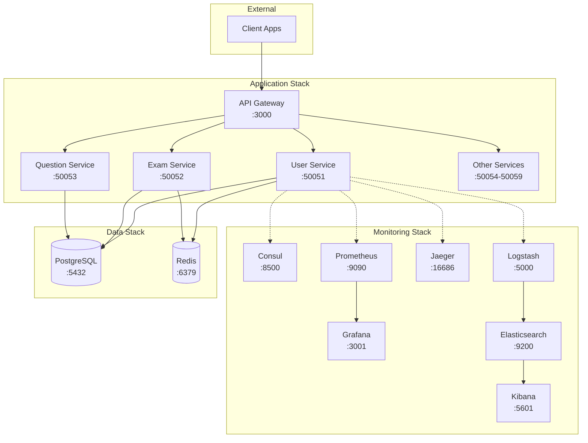
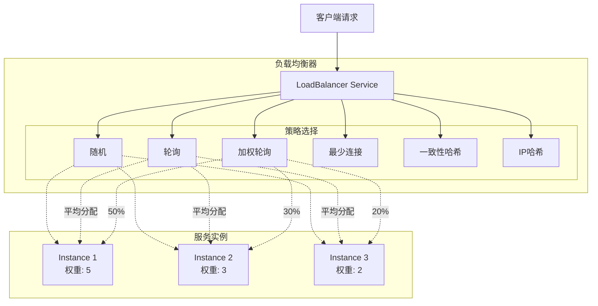
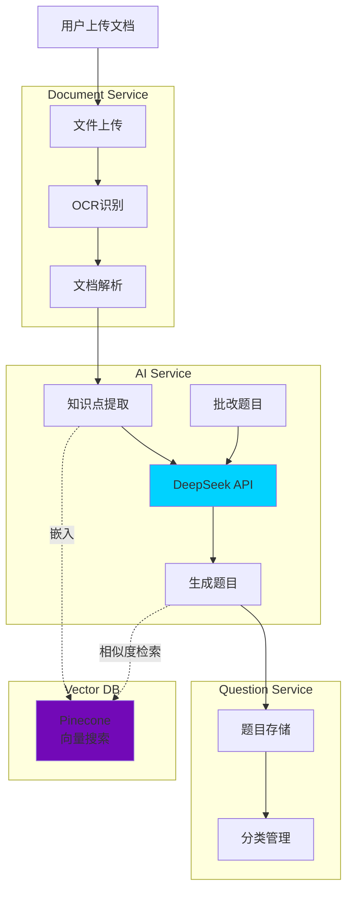
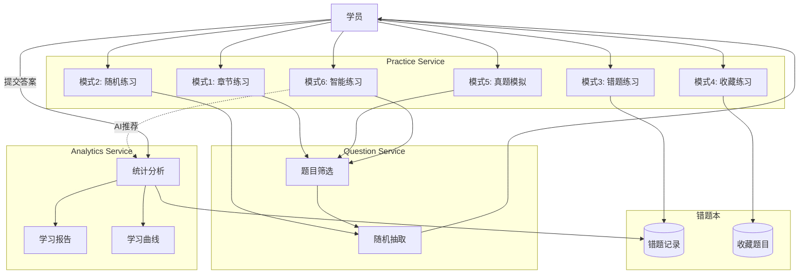

# 🎨 系统架构图（可视化版本）

> 使用Mermaid绘制的交互式架构图，可在GitHub、GitLab等平台直接渲染

---

## 1. 整体系统架构

---

## 2. 微服务间调用关系

---

## 3. 数据流图

---

## 4. 监控系统架构

---

## 5. 日志聚合架构

---

## 6. 链路追踪架构

---

## 7. 部署架构（Docker Compose）

---

## 8. 负载均衡策略

---

## 9. AI服务工作流

---

## 10. 练习模式架构

---

## 使用说明

### 在GitHub/GitLab中查看

这些Mermaid图表会在GitHub和GitLab中自动渲染为交互式图表。

### 在本地编辑器中查看

推荐使用以下工具：
- **VS Code** + Mermaid Preview插件
- **Typora**（支持原生Mermaid）
- **在线编辑器**：https://mermaid.live/

### 导出图片

访问 https://mermaid.live/，粘贴代码，导出为PNG/SVG。

---

**架构图版本：** V1.0  
**最后更新：** 2025-10-14  
**绘制工具：** Mermaid

